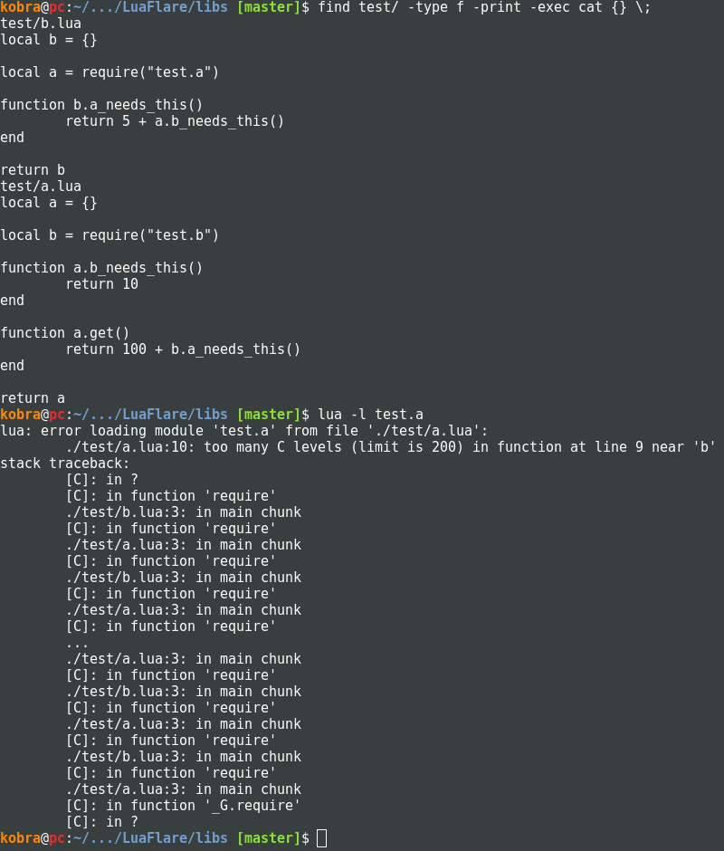
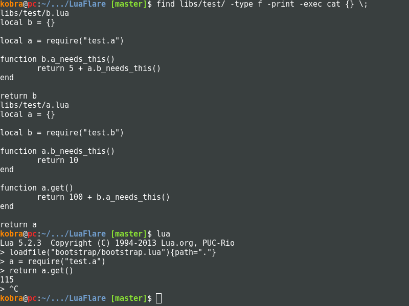

# Bootstrapping

TODO: Explain how LuaFlare sets it's Lua extensions up.

## Syntax Extensions

LuaFlare provides some type-checking syntax.  Before loading any code, either by `require()`, `dofile()`, or `include()`, LuaFlare will process the file, and translate the type information to an immediate call to `expects()`.

#### type arg `function(type arg)`

Tests `arg` against `"type"`.

#### :: `function meta::func()`

Test `self` against `meta`.

#### meta& arg `function(meta& arg)`

Tests `arg` against `meta`.

#### arg=default `function(msg="hello")`

Set `arg` to `default` if `arg == nil` (placed before `expects()`).

### How `expects()` works

`expects()` will examine the stack, and compare it with the arguments that have been passed to it.

If the type passed type is a string, it will check it against the function `expects_types[typestr](value)` if it exists, else `type(value) == typestr`.  The type string `"any"` will just check against a non-nil value.

If the passed type is nil, it will ignore this argument.

If the passed type is a table, it will ensure the value table contains the same functions (via `metatable_compatible()`).

`expects()` also checks against too many arguments being passed to it.  So this will throw an error: `function(a) expects("string", "number")`

### Examples, along with translations

#### Standard

`function(string a, number b)`

`function(a, b) expects("string", "number")`

#### `self` checking.

`function meta::func()`

`function meta:func() expects(meta)`

#### Metatable

`function(meta& a)`

`function(a) expects(meta)`

#### Complex

`function meta::dosomething(string arg, meta& other, string message = "hello")`

`function meta:dosomething(arg, other, message) if message == nil then message = "hello" end expects(meta, "string", meta, "string")`

## Automatic Circular Requires

Very often, a module may have a circular dependency,
such as module "a" requires "b", and module "b" requires "a".
In C/C++, such dependencies are resolved by using header guards.
Such a system is not compatible with Lua as there is no such thing as a definition.
Often, providing a reference to the table that is yet to be populated is enough,
as the require-er does not need to use the library right away.

In standard Lua, an early reference that subsequent requires will return is set
by filling in the `package.loaded` field for your module.

The module name is passed as the first argument, so you may fill in the package.loaded field via the following code:

	local mod_name = {}
	package.loaded[...] = mod_name

When doing this, the `return mod_name` at the end of the file is no longer necessary,
but is kept for semantic purposes.

The bootstrap's require will automatically detect modules where the first (meaningful) tokens are defining an empty table,
*and* the file's last tokens are returning the same table,
then a reference right after the table has been created is installed into the package.loaded table.
This allows, for 99% of cases for circular requires to be resolved.

This works because nearly all modules will only use the required modules after they've *returned* from the main function.
In other words, the main 'file function' only populates the module table, loads & saves references to other modules,
and then returns.  The actual modules needed are often only called once everything has been populated.
For these reasons, it is discouraged to use the 'population' function as a means to do work.  If you need to do work on load,
please use the hook named "Loaded", which will be called after LuaFlare is started up.

## Bootstrap table

The bootstrap table contains a number of functions that may be used early in the
LuaFlare boot process.

### `bootstrap.pack`

unpack()
options={}
log_buffer={}
log_depth=0
log_deeper()
log_shallower()
log(str,...)
fatal(str,...)
loadfile(path,...)
module(name,path)
extend(name, path)
level_string = ""
level_cache = {}
level(name)
set_level(name)

## Bootstrap Process

at 5.2, make compatible to 5.1
setup the hook module
setup the string reader module
setup the luaparser module
setup the stack module
setup global extensions
setup string extensions
setup table extensions
setup math extensions
setup os extensions

setup translator
setup global includes/requires and stuff that uses the translator
setup depreiciated stuff
set process name

done

