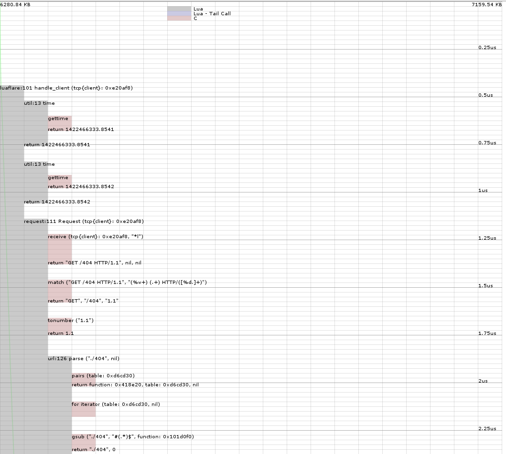

# LuaFlare profiler library

`local profiler = require("luaflare.profiler")`

A simple library to profile code using the debug library.

## `profiler.start(string output_file = "profile.log", boolean run_gc = false)`

Outputs a log file in the format of:

	$time	$memory	$(+|~|-)	$name	$path:$line	$(args|returns)

The arg `run_gc` specifies whether we should run the garbage collector
every time we call or return from a function.

## `profiler.stop()`

Stop running the profiler.

## CLI Tool

Invoke `./profile.lua <input.log> <output.svg> [scale=1us]`.

